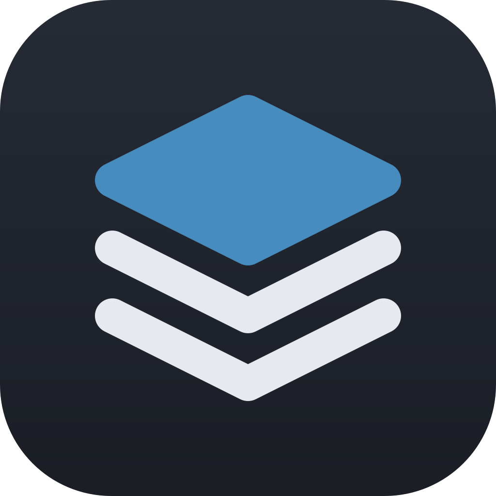

# Loadout



Keeps the same set of editor plugins in every Godot project. Godot has no global editor
plugins, so Loadout lives in each project and brings the others along: it installs missing
plugins from one registry on your computer, keeps their versions in a lock file and tells you
when updates are out.

- **One registry for all projects**: plugins from the Godot Asset Store, GitHub Releases or a
  local folder.
- **New project in one click**: Loadout lists the missing plugins when the editor starts, you pick
  which ones the project gets.
- **Works with the Asset Store**: install a plugin from Godot's Asset Store as usual and Loadout
  offers to take it over.
- **Reproducible versions**: `loadout.lock.json` records the version, pin and folder hash of each
  plugin. Commit it and a fresh clone gets exactly the same versions.
- **Safe updates**: checked at most once a day, always confirmed, backed up and rolled back
  automatically when the new version does not start.
- **Hands off your changes**: a plugin you edited by hand or pinned is never overwritten without
  asking.
- **Any version**: install an older release and pin it in one project.
- **Updates itself**, has no dependencies and runs only in the editor.

Requires Godot 4.7+.

## Installation

Copy `addons/loadout` into your project's `addons` folder (or install it from the
Asset Store) and enable **Loadout** in **Project → Project Settings → Plugins**.

For many projects, the install script from this repository does both steps in one command. It is
safe to run again; a different Loadout version is replaced only with `--force` (close the project's
editor first):

```bash
tools/install_loadout.sh ~/path/to/your/project
```

The script finds Godot in `$GODOT`, in `PATH` or in `/Applications/Godot.app`. On Windows (or
anywhere) run it through Godot directly:

```bash
godot --headless --path <this repository> --script res://tools/install_loadout.gd -- <your project>
```

## Getting started

Loadout adds the **Loadout** dock to the right side of the editor (in Godot 4.7 a tab next to
History, Signals and Groups; like any dock it can be moved). The registry starts empty:

1. Click **+** and add the plugins you want everywhere (see [Adding plugins](#adding-plugins)).
2. Install them in the current project from the dock.
3. Open another project with Loadout: it lists the missing plugins, you confirm, done.

The dock header has three buttons: **⟳** checks for updates right away, **+** adds a plugin to
the registry and **⋮** exports or imports the registry and explains the GitHub token.

## Adding plugins

| Source | What you enter |
| --- | --- |
| Asset Store | Search by name. Free add-ons compatible with your Godot version, with all their releases. |
| GitHub Releases | `owner/name` or the repository URL. Loadout installs the release's zip asset, or the tag's source zip. |
| Local folder | A folder with `plugin.cfg`, for your own plugins. Offers the version that is in it. |

- **Folder in addons/** is where the plugin goes in each project. On the first install Loadout checks
  the folder the package uses; if it differs (for example `gdscript-templates` versus
  `gdscript_templates`), Loadout asks to switch to the package's folder, because many plugins use
  fixed `res://addons/<folder>/` paths.
- **Allowed versions**: `*` (always the newest), `^1.2.0` (minor and patch updates) or `~1.2.0`
  (patch updates only).
- **Install automatically in every project**: the plugin is offered in every project that does
  not have it.

**Plugins installed from Godot's Asset Store**: when a new plugin appears in `addons/` while the
editor runs, Loadout asks whether to add it to your global plugins. The registry dialog opens with
the plugin's folder and an Asset Store search for its name; an exact match is already selected.

**Plugins you already had** before adding Loadout are listed under **Project addons not in the
registry**. **Add to registry…** does the same as above and takes over the current files: Loadout
records them in the lock without copying anything.

## Plugins in the dock

| State | Meaning | Actions |
| --- | --- | --- |
| Up to date | Installed, matches the lock | Pin, install another version, remove from project |
| Missing | In the registry, not in this project | Install, install another version, ignore in this project |
| Update | A newer version within the range is out | Update (shows the release notes), pin, install another version |
| Pinned | Pinned in this project | Unpin, install another version, remove from project |
| Modified | Folder differs from the lock (edited by hand) | Accept changes, overwrite (with backup), remove |
| Not managed | Folder exists, Loadout did not install it | Take over, overwrite (with backup) |
| Ignored | This project opted out | Stop ignoring |
| Unverified | Source unreachable, cached data used | Pin, remove from project |
| Not in registry | In the lock, no longer in the registry | Forget |

**Install missing…** opens the same list as at startup: a checkbox per plugin, and the unchecked
ones can be ignored in this project. **Update all…** updates every plugin with an update in one
confirmation (pinned ones are skipped).

**Edit…** changes a plugin's registry entry: its source (for example a different repository or
an Asset Store asset instead of GitHub), the allowed versions and whether it is installed
automatically. Id and folder stay the same, so installed copies keep working. The dock shows the
effect right away, for example an update that the new range allows.

**Remove from project…** deletes the folder (with a backup) and ignores the plugin in this
project, so the next start does not bring it back. **Remove from registry…** stops offering the
plugin everywhere; files in projects stay.

Pins and ignores are per project (in `loadout.lock.json`), the registry is shared by all projects.

## Versions and pinning

**Install version…** lists every version the Asset Store or GitHub offers, newest first, with
release notes and marks for the installed version, prereleases and versions outside the range.

**Pin** keeps a plugin at its installed version in one project: no update offers there, other
projects still get updates. Installing an older version pins it by default, otherwise Loadout would
offer the update right back.

## Updates

Sources are asked at most once a day; **⟳** asks right away. A toast at editor start tells you
when updates are available. Every update is confirmed and works like this:

1. The plugin is disabled and its folder backed up.
2. The files are replaced, keeping existing `.uid` files so `uid://` references stay valid.
3. The editor rescans the project, reloads the plugin's scripts and checks that the new version
   compiles.
4. The plugin is enabled again and Loadout checks that it really runs.
5. If any step fails, the backup comes back.

When a new version removes a `class_name`, the editor keeps listing it until a restart, so Loadout
offers one.

**Loadout itself** can be in the registry too (folder `loadout`). It cannot disable
itself, so it replaces its files and restarts the editor right away; it can never remove itself.

Offline or when a source fails, Loadout uses the data it saved last time and shows a warning in the
dock.

## Files

| File | Where | In git |
| --- | --- | --- |
| `loadout_registry.json` | Editor config folder: `~/Library/Application Support/Godot/` (macOS), `%APPDATA%\Godot\` (Windows), `~/.config/godot/` (Linux) | no |
| `loadout_cache.json` | Editor config folder (update checks, safe to delete) | no |
| `loadout.lock.json` | Project root | yes |

Backups of replaced and removed plugins go to `user://loadout_backup/<plugin>/<version>/`. A damaged
JSON file is never overwritten: Loadout copies it to `*.bak` and reports it in the dock. The **⋮**
menu exports the registry to a file and imports one, for example on another computer (only new
plugins are added, existing ones stay as they are).

## GitHub token

GitHub allows 60 API requests per hour without a token. Loadout asks each repository at most once a
day, so that is plenty for most setups. With a token the limit is 5000 per hour and unchanged
answers (`304 Not Modified`) do not count. To use one, create a fine-grained token with read
access to public repositories and set it in **Editor → Editor Settings → Loadout →
Github Token**. It stays in your editor settings, is sent only to `api.github.com` and never ends
up in the project or the log.

## Security and limits

- Loadout installs only from sources in your registry, always over HTTPS.
- Paid Asset Store assets are not supported.
- Registry entries from the old Asset Library (godotengine.org/asset-library) keep working; new
  ones come from the Asset Store.

## Development

Tests run headless and need no network or test framework:

```bash
godot --headless --path . --import
godot --headless --path . --script res://tests/run_tests.gd
```

Smoke tests that run in a real editor are described in `tests/editor/installer_smoke.gd`.

## License

MIT
