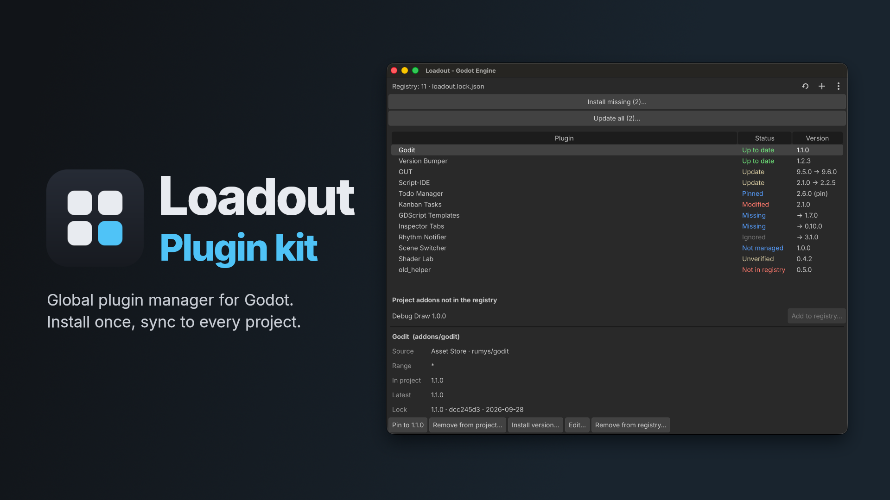

# Loadout

The global plugin manager for Godot: one registry, every project in sync. Godot has no global
editor plugins, so Loadout lives in each project and brings the others along. It installs the
plugins a project is missing, keeps their versions in a lock file and tells you when updates are out.



## Features

- **One registry for all projects**: plugins from the Godot Asset Store (with search), GitHub
  Releases or a local folder, shared by every project on your computer.
- **New project in one click**: on start Loadout lists the missing plugins and you pick which ones
  the project gets.
- **Reproducible versions**: `loadout.lock.json` records the version, pin and folder hash of each
  plugin. Commit it and a fresh clone gets exactly the same versions.
- **Safe updates**: checked once a day, always confirmed, backed up and rolled back when the new
  version does not start. No editor restart needed.
- **Pin or pick any version**: keep a plugin at one version in one project, or install an older
  release.
- **Hands off your changes**: a plugin you edited by hand or pinned is never overwritten without
  asking.
- **Takes over what you already have**: add plugins that are already in the project to the registry
  without reinstalling them.
- Updates itself, has no dependencies and runs only in the editor.

## Install

1. Copy `addons/loadout/` into your project's `addons/` folder (or install it from the Asset Store).
2. Enable **Loadout** in **Project → Project Settings → Plugins**.

You need Godot 4.5 or newer (tested on 4.5.1 and 4.7.1). For many projects, one command does both steps. It is safe to run again, and
a different Loadout version is replaced only with `--force` (close the project's editor first):

```bash
tools/install_loadout.sh ~/path/to/your/project
```

It finds Godot in `$GODOT`, in `PATH` or in `/Applications/Godot.app`. On Windows run the same
through Godot: `godot --headless --path <this repository> --script res://tools/install_loadout.gd -- <your project>`.

## Usage

Everything is in the **Loadout** dock on the right side of the editor. Drag a column border in the
plugin list to resize it, double-click it to fit the column to its text.

- **Add a plugin**: **+** searches the Asset Store, takes a GitHub repository (`owner/name`) or a
  local folder with `plugin.cfg`. Allowed versions: `*` (newest), `^1.2.0` (minor and patch
  updates) or `~1.2.0` (patch updates only). Plugins that appear in `addons/` by other means are
  offered for the registry too.
- **Starter plugins…** (in **⋮**): the install dialog with two lists. On the left are the plugins
  this project lacks from your registry and the **Starter pack** (tagged), a short list of plugins
  that suit most projects. Move what you want to the right (button or double-click), **Install
  selected** adds it to your registry where needed and installs it. **Details…** on a card loads what
  the plugin is for and the release notes of a version. The checkbox **Hide the starter pack from now
  on** turns it off; it comes back from the same menu entry. The dialog opens by itself the first time and again when an update adds a new starter.
- **New project**: the missing plugins are listed with a checkbox each, unchecked ones can be
  ignored in this project. **Install missing…** opens the same list later.
- **Update**: a plugin with a newer version shows **Update** and its release notes. **Update all…**
  does every one in a single confirmation. **⟳** checks for updates now.
- **Pin** keeps a plugin at its version in this project only. **Install version…** lists every
  release, and installing an older one pins it.
- **Modified** means the folder differs from the lock: **Show changes…** lists the files,
  **Accept changes** keeps your edits, **Overwrite** replaces them (with a backup).
- **Restore backup…** brings back an earlier copy Loadout saved (before an update, an overwrite or a
  removal). The newest 10 backups of each plugin are kept.
- **Include pre-releases** (in the add/edit dialog) offers betas and release candidates as updates.
  If a new release does not start on your Godot version, Loadout offers the next older one.
- **Remove from project…** deletes the folder (with a backup) and ignores the plugin here.
  **Remove from registry…** stops offering it in all projects. **⋮** exports and imports the registry.

## How updates work

The plugin is disabled and its folder backed up to `user://loadout_backup/`, the files are replaced
(existing `.uid` files are kept), the editor rescans and checks that the new version compiles, then
the plugin is enabled and checked again. Any failure brings the backup back. Loadout updates itself
the same way and restarts the editor. Offline, it uses the data it saved last time and warns in the
dock.

## Files and settings

- `loadout.lock.json` in the project root records versions, pins and ignored plugins. **Commit it.**
- `loadout_registry.json` and `loadout_cache.json` (safe to delete) live in the editor config folder:
  `~/Library/Application Support/Godot/` (macOS), `%APPDATA%\Godot\` (Windows) or `~/.config/godot/`
  (Linux). Neither goes into git.
- A damaged JSON file is never overwritten: Loadout copies it to `*.bak` and reports it in the dock.
- Loadout installs only from sources in your registry, always over HTTPS. Paid Asset Store assets
  are not supported.
- **GitHub token** (optional): without one GitHub allows 60 API requests per hour, which is plenty
  because each repository is asked once a day. Set a fine-grained token with read access to public
  repositories in **Editor → Editor Settings → Loadout → Github Token** for 5000 per hour. It is
  sent only to `api.github.com` and never ends up in the project or the log.

## License

MIT, see [LICENSE](LICENSE).
